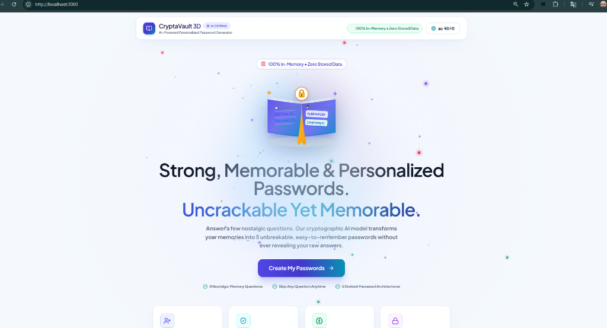
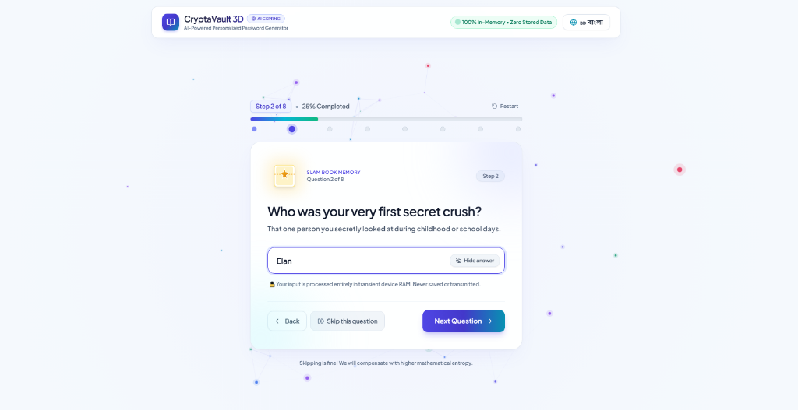
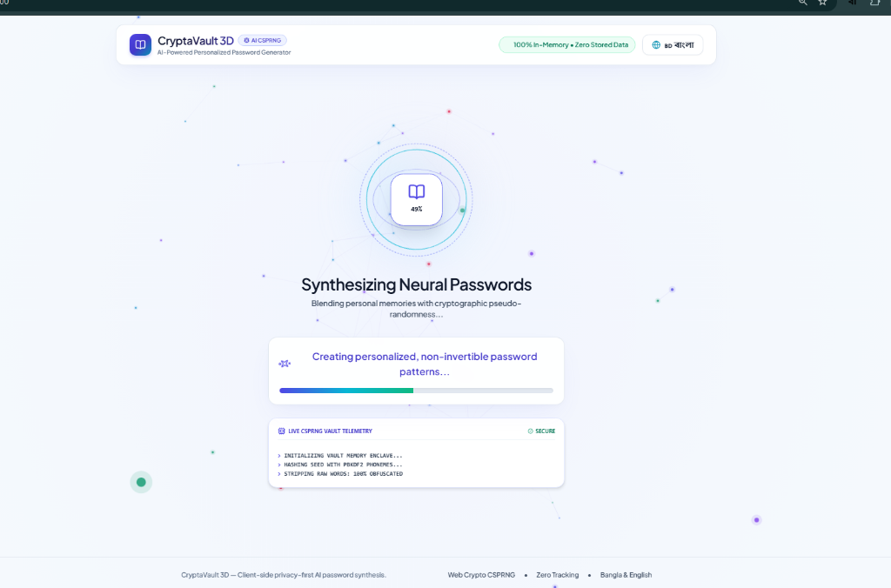
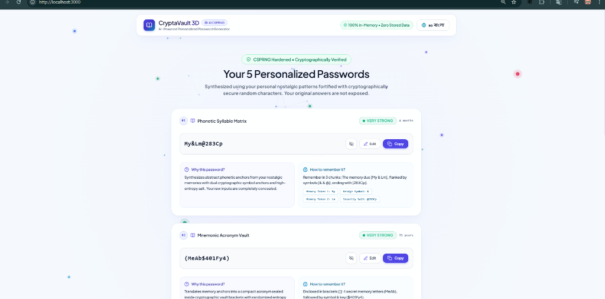

# CryptaVault 3D — Personalized AI Password Generator

> **"Answer a few nostalgic questions. Get 5 unbreakable passwords you can actually remember."**

An interactive, modern 3D-styled web application built with React, TypeScript, and Tailwind CSS. It helps users generate strong, memorable, and personalized passwords based on their nostalgia and memory entries without requiring an account or storing sensitive personal data.

---

## 📸 Application Previews

### 1. Modern Bright 3D Landing Page


### 2. Step-by-Step Nostalgic Memory Questionnaire


### 3. Holographic AI Cryptographic Processing Screen


### 4. 5 Personalized Password Results & Mnemonics


---

## 🌟 Key Features

1. **No Account or Registration Required**:
   - Zero registration, zero emails, and zero stored personal data.
   - Everything runs client-side in transient device RAM.

2. **Personalized Nostalgic Questionnaire (8 Steps)**:
   - **Step 1**: Your first love (*আপনার প্রথম ভালোবাসা*)
   - **Step 2**: Your first secret crush (*আপনার প্রথম গোপন ক্রাশ*)
   - **Step 3**: Your favorite classmate (*আপনার প্রিয় সহপাঠী*)
   - **Step 4**: Unconfessed classmate crush (*পছন্দ করতেন কিন্তু কখনো বলেননি*)
   - **Step 5**: Married crush / secret admiration (*বিবাহিত ব্যক্তি বা সেলিব্রিটি*)
   - **Step 6**: Body count (*বডি কাউন্ট*)
   - **Step 7**: Class 10 roll number (*ক্লাস ১০-এর রোল নম্বর*)
   - **Step 8**: Biggest mistake/sin (*জীবনের সবচেয়ে বড় ভুল বা পাপ*)
   - **Skip Option**: Skip any question at any time with zero penalty (compensated with increased mathematical entropy).
   - **Privacy Mask Toggle**: Eye icon to mask typed input into bullets in public.

3. **Complete Bilingual Support (🇧🇩 বাংলা & 🇬🇧 English)**:
   - Full toggle switch in the top-right header and footer.
   - All questions, UI, buttons, hints, "Why this password?", "How to remember it?", and strength warnings are localized naturally.

4. **Cryptographic Privacy & Security**:
   - User answers are **never** directly exposed or concatenated (e.g. `"Rahim"` never becomes `"Rahim123!"`).
   - Abstract phonetic tokens, syllable matrices, and non-invertible consonant skeletons are extracted.
   - Cryptographically Secure Pseudo-Random Number Generation (`window.crypto.getRandomValues`).
   - High entropy (14-18 characters, uppercase, lowercase, numbers, and symbols).

5. **5 Distinct Password Architectures**:
   - **Password 1: Phonetic Syllable Matrix + Cryptographic Salt**
   - **Password 2: Mnemonic Acronym Passphrase + Security Token**
   - **Password 3: Subtle Phoneme Fusion + Dual Entropy Enclave**
   - **Password 4: Rhythmic Cadence Mnemonic Code**
   - **Password 5: High-Entropy Secure Vault Pattern (16+ chars)**

6. **Interactive Features per Password**:
   - **1-Click Copy**: Visual feedback badge + direct clipboard write.
   - **Inline Edit**: Modify any password with real-time strength re-evaluation and warning banner if weakened.
   - **Password Strength Meter**: Calculated with `zxcvbn` (Weak, Moderate, Strong, Very Strong) with estimated crack time.
   - **Why was this password generated?**: Simple explanation without exposing original secrets.
   - **How to remember it?**: Mental chunking technique and memory pills.
   - **Regenerate**: Instantly generate 5 fresh passwords with new cryptographic randomness.
   - **Start Over**: Clears all transient memory and returns to landing.

7. **Modern 3D Cyber UI / UX**:
   - Interactive 3D particle constellation canvas responding to mouse and touch movement.
   - Glassmorphism, soft glows, 3D card tilt elevation.
   - 3D memory book illustrations for each questionnaire step and hero showcase.
   - Fully responsive for mobile phones, tablets, and desktops.

---

## 🚀 Quick Start

### 1. Clone the Repository
```bash
git clone https://github.com/xsazedul/Personalized-AI-Password-Generator.git
cd Personalized-AI-Password-Generator
```

### 2. Install Dependencies
```bash
npm install
```

### 3. Start Local Development Server
```bash
npm run dev
```
Open `http://localhost:3000` in your web browser.

### 4. Build for Production
```bash
npm run build
```
Production assets will be generated in the `dist/` directory.

---

## 🔒 Privacy Guarantee

- **Client-Side Only**: Cryptographic transformations occur locally in your browser.
- **Zero Storage**: No `localStorage`, no `sessionStorage`, no cookies, no tracking telemetry.
- **Wiped on Reset**: Answers exist solely in transient React state and are wiped upon clicking "Start Over" or closing the tab.
